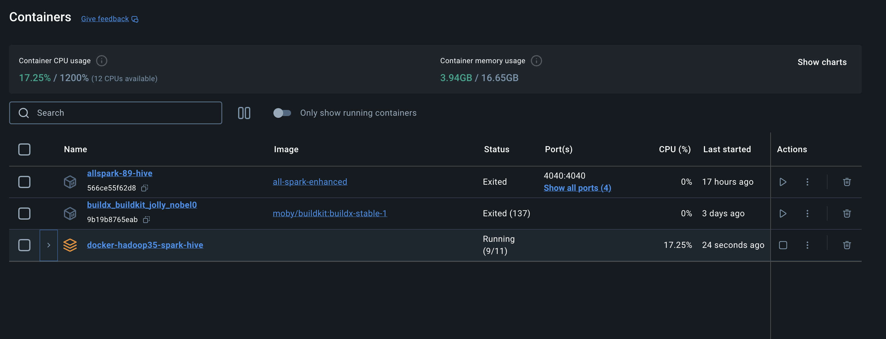

Got it! Here's the updated README with the correct versions and additional notes:

# 🐳 **Docker Compose Environment for Hadoop, Hive, and Spark**

Spent some time getting this Docker Compose setup for Hadoop, Hive, and Spark! This environment is tailored for our executive education study group, providing a robust platform for exploring and experimenting with big data technologies as part of our Big Data module. Given we didn't have an option to use the newer Hadoop ecosystem for the code challenges.

## 📦 **What's Inside?**

This repository houses a comprehensive Docker Compose configuration that includes:
- **🗄️ Hadoop**: A powerful framework for distributed storage and processing of large datasets. **Version: 3.1.3** (from `bde2020/hadoop-namenode:2.0.0-hadoop3.1.3-java8` and `bde2020/hadoop-datanode:2.0.0-hadoop3.1.3-java8`)
- **🏛️ Hive**: A data warehouse software that facilitates reading, writing, and managing large datasets in distributed storage. **Version: 2.3.2** (from `bde2020/hive:2.3.2-postgresql-metastore`)
- **⚡ Spark**: A unified analytics engine, supporting big data processing with built-in modules for streaming, SQL, machine learning, and graph processing. **Version: 3.5.2** (from `bitnami/spark:3.5.2`)

## 🌐 **Network Configuration**

We’ve established a custom bridge network named `spark-hive` to ensure seamless communication between services. This configuration allows easy access to Hadoop and Spark interfaces from your Jupyter notebooks. For an optimal experience, we recommend using the `jupyter/all-spark-notebook` image available on [Docker Hub](https://hub.docker.com/r/jupyter/all-spark-notebook).

## 💻 **Special Instructions for Mac M1 (ARM64) Users**

If you're using a Mac with an M1 (ARM64) chip, please **do not** run the `docker-compose build --no-cache` command. Instead, follow the instructions in [READ-ME/Mac-m1-arm64.md](READ-ME/Mac-m1-arm64.md) to ensure compatibility. Basically, this needs to be built in amd64 mode.

## 🧹 **Cleanup and Troubleshooting**

If you encounter issues, such as network conflicts or an accumulation of unused Docker images, detailed cleanup instructions are available below. Here are a few quick solutions:
- **Network Conflicts**: You might need to delete and recreate the network if a conflict occurs.
- **Docker Cleanup**: Regular cleanup of your Docker environment is recommended to prevent resource issues.

## 🚀 **Getting Started**

To get this environment up and running, follow these steps:

1. **Clone the Repository**:
   ```bash
   git clone https://github.com/naveenNTP/docker-hadoop-hive-dsai2024.git
   cd docker-hadoop-hive-spark
   ```

2. **Build Docker Images**:
   For arm64 Mac please see [READ-ME/Mac-m1-arm64.md](READ-ME/Mac-m1-arm64.md) 

   - For the initial build, use:
     ```bash
     docker-compose build --no-cache
     ```
   - For subsequent builds, simply run:
     ```bash
     docker-compose build
     ```

3. **If the bridge network is not created**:
   ```bash
   docker network create --driver bridge spark-hive
   ```

4. **Launch the Docker Compose System**:
   ```bash
   docker-compose up -d
   ```

5. **Access the Services**:
   - **🌐 Hadoop NameNode UI**: [http://localhost:9870/dfshealth.html#tab-overview](http://localhost:9870/dfshealth.html#tab-overview)
   - **🌐 Hadoop DataNode UI**: [http://localhost:9864](http://localhost:9864)
   - **🌐 History server**:[http://localhost:8188/applicationhistory](http://localhost:8188/applicationhistory)
   - **🌐 Nodemanager**:[http://localhost:8042/node](http://localhost:8042/node)
   - **🌐 Resource manager**:[http://localhost:8088](http://localhost:8088)
   - **🌐 HiveServer2 UI**: [http://localhost:10000](http://localhost:10000) - not working 
   - **🌐 Spark Master UI**: [http://localhost:8080](http://localhost:8080) - Disabled 
   - **🌐 Spark Worker 1 UI**: [http://localhost:8081](http://localhost:8081) - Disabled 

## 🧹 **Bringing Down the Environment and Cleanup**

Once you’re done experimenting with the Hadoop, Hive, and Spark environment, it’s essential to clean up to free up resources on your system. Follow these steps:

### 1. **Stop and Remove Containers**
To stop and remove all containers, networks, and volumes created by Docker Compose, use the following command:
```bash
docker-compose down -v
```
This command will:
- Stop all running services.
- Remove containers, networks, and volumes defined in your `docker-compose.yml` file.

### 2. **Remove Unused Docker Objects**
If you want to clean up your Docker environment further, you can remove all unused Docker objects, such as dangling images, stopped containers, and unused networks and volumes:
```bash
docker system prune -a --volumes
```
This command will:
- Remove all stopped containers.
- Delete all unused networks.
- Remove dangling images and build cache.
- Delete all unused volumes.

**⚠️ Note:** The `-a` flag removes all unused images, not just dangling ones, so be cautious if you have images you want to keep.

### 3. **Verify Cleanup**
To ensure everything has been cleaned up, you can list the remaining Docker objects:
- **Containers:**
  ```bash
  docker ps -a
  ```
- **Images:**
  ```bash
  docker images -a
  ```
- **Volumes:**
  ```bash
  docker volume ls
  ```
- **Networks:**
  ```bash
  docker network ls
  ```

If nothing is listed, your Docker environment is fully cleaned up.

---

These instructions are precise and ensure that your system remains tidy after running the big data stack. Let me know if you need further customization!

### Note on Images

The images for DataNode, NameNode and other hadoop services ( not hive ) include Python, which can be useful for various data processing  tasks which we had a hard time with 

### Idle i see it used ~ 4GB of Ram which is cool :)
- Spark was not running 9/11


## 🎓 **Purpose**

This Docker Compose environment was created specifically for our executive education study group as part of the Big Data Analytics (BDA) module. We encountered challenges in finding a modern and functional Hadoop setup, leading to the creation of this system for local experimentation and assignment completion.

## 🛠️ **Troubleshooting Tips**

In case of any issues:
- **Ensure** that Docker and Docker Compose are correctly installed and operational.
- **Check Service Logs** to diagnose errors:
  ```bash
  docker-compose logs
  ```
- **Restart Services** if necessary:
  ```bash
  docker-compose restart
  ```

## 🤝 **Good luck**

Made with ❤️🎓 by [Naveen](https://www.linkedin.com/in/naveen-devops-sre/)

**Happy building! 🚀 & experimenting with your Big Data environment!** 🐋

---

### Volume Mounts

The following volumes have been added to the Hive server, DataNode, and NameNode to allow copying exercise files from two directories above - Hadoop and Spark folders:
```yaml
volumes:
  - ../../Hadoop/:/opt/Hadoop
  - ../../Spark/:/opt/Spark
```
You can customize these paths as required in the `docker-compose.yml` file.

### Spark Master and Spark Worker Disabled

We have disabled the Spark Master and Spark Worker services in the `docker-compose.yml` file. Instead, we are using the `jupyter/all-spark-notebook` image, which comes with an inbuilt Spark setup. This allows us to execute all Spark-related tasks within Jupyter notebooks, providing a more integrated and user-friendly environment. You can find the Jupyter image on [Docker Hub](https://hub.docker.com/r/jupyter/all-spark-notebook).

### Note on Images

The images for DataNode, NameNode, and other services include Python, which can be useful for various data processing tasks.

Feel free to reach out if you need any more help!
- [Naveen](https://www.linkedin.com/in/naveen-devops-sre/)